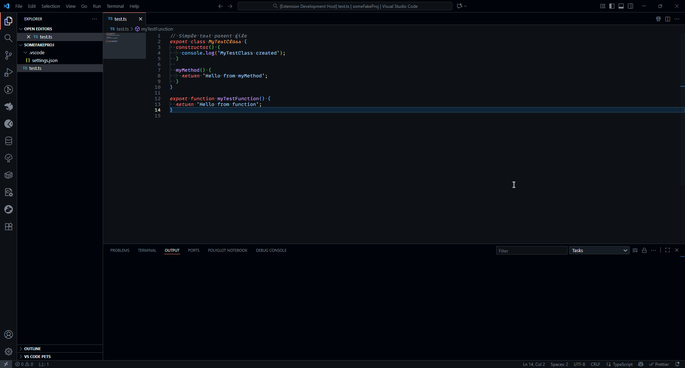

# Nested File Toolkit

Nested File Toolkit provides utilities for working with nested files in your VS Code workspace. It helps you quickly create, open, and manage related files that follow naming conventions, such as test files, style files, or component files.



## Features

- **Create Nested Files**: Right-click a file and use the command to generate related files (e.g., test, style, or story files) based on your workspace's file nesting patterns and templates. The extension will prompt you to select which nested files to create, and will open them in the editor.

- **Split Editor with Related File**: Quickly open a related file (such as a test or parent file) beside the current file. The extension detects whether the current file is a parent or child in your nesting patterns and offers to open the most relevant related file. If multiple candidates exist, you can pick which one to open.

- **~symbol References**: In nested files, you can create clickable references to symbols in parent files using the `~` syntax. Simply write a comment like `// ~MyClass` and Ctrl+Click on it to navigate to its definition in the parent file. This works with classes, functions, interfaces, and other symbols.

## Usage

1. **Configure File Nesting Patterns**: In your VS Code settings, set up `explorer.fileNesting.patterns` to define how files are related. For example:

```json
"explorer.fileNesting.enabled": true,
"explorer.fileNesting.patterns": {
  "*.ts": "$(capture).spec.ts,$(capture).style.ts",
  "*.component.ts": "$(capture).component.html,$(capture).component.scss"
}
```
VS Code includes defaults for this setting. These are also supported by this extension.

2. **(Optional) Configure Templates**: You can provide custom templates for new files using the `nested-file-toolkit.templates` setting. Templates can use placeholders like `{{name}}`, `{{fileName}}`, `{{capture}}`, `{{nestedFileName}}`, `{{nestedName}}`, and `{{date}}`.

3. **Create Nested Files**: Right-click a file in the Explorer or use the command palette, then select "Create Nested Files". Choose which files to create from the suggested list. The extension will create and open the new files, or open existing ones if they already exist.

4. **Split with Related File**: With a file open, run the "Split with Related File" command. A button for this command gets added to the title bar. The extension will find and open a related file (child or parent) beside the current editor, making it easy to work on related files together.

5. **Use ~symbol References**: In any nested file, you can reference symbols from the parent file using comments:
   ```typescript
   // ~MyClass
   // This creates a clickable link to MyClass in the parent file
   
   /* ~myFunction */
   // Block comments work too!
   ```
   When you Ctrl+Click (Cmd+Click on Mac) on the `~symbolName`, VS Code will navigate to its definition in the parent file. Hovering over it shows which parent file(s) contain it. The reference will be highlighted. This behavior can be toggled using the `nested-file-toolkit.enableParentRefs` setting.

## Extension Settings

This extension contributes the following settings:
- `nested-file-toolkit.templates`: (Optional) Custom templates for new nested files. Keys are glob patterns, values are template strings with placeholders.
- `nested-file-toolkit.enableParentRefs`: Enable or disable highlighting of parent file references using the `~` prefix. Set to `false` to disable “~ symbol references” (default: `true`).

## Known Issues

None as of right now. If you encounter any issues or grievances, please report them on [GitHub](https://github.com/Naamloos/nested_file_toolkit/issues).

## Suggestions?

Please open an [issue on GitHub](https://github.com/Naamloos/nested_file_toolkit/issues).

## Release Notes

### 1.0.0

Initial release of Nested File Toolkit
